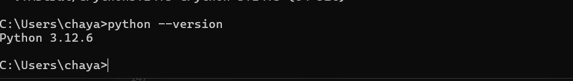
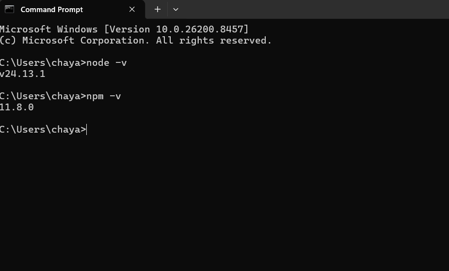

# 🤖 AI Vision Integration Task — DataByte

> **Goal:** Build a real-time, browser-based handwritten digit recognition app (1-9) powered by a local MNIST model — no cloud APIs, no shortcuts, just you, the code, and the model.

---

## 📖 What Is This Project?

This is a full-stack AI integration task. You're given a **pretrained MNIST handwritten digit recognition model** — already trained, already smart — and your job is to wire it into a working web application that:

- Lets a user **upload a handwritten digit image** through a browser
- Sends that image to a **Python backend** over a **WebSocket** connection
- Runs **AI inference locally** on your machine (no external APIs)
- Sends back a **JSON prediction** (e.g., `"5"` with `97% confidence`)
- **Displays the result** live on the frontend

Think of yourself as an **AI integration engineer**, not a researcher. The model is already built. Your job is to make it useful.

---

## 🧠 Before You Start — Build Your Intuition

Before jumping into commands, take 5 minutes to understand *why* things are structured the way they are. This intuition will save you hours of debugging later.

### Why a Backend?
The AI model (`mnist-12.onnx`) is a binary file that runs using Python libraries (`onnxruntime`, `numpy`, `Pillow`). **Browsers cannot run this directly.** So we need a Python server that:
1. Receives the handwritten digit image
2. Runs the model
3. Returns the predicted digit (1-9)

### Why WebSockets?
Regular HTTP (`fetch`, `XMLHttpRequest`) is a one-shot deal — you ask, you get one answer, connection closes. WebSockets keep the connection **open**, so you can send images and receive predictions continuously in real time without reconnecting each time. This is what makes the experience feel instant and live.

### Why ONNX?
The model was originally trained in PyTorch. ONNX (Open Neural Network Exchange) is a **universal format** — like a PDF for AI models. You can train in PyTorch and run in any language/framework that supports ONNX. `onnxruntime` is the engine that runs it.

### What is MNIST?
MNIST (Modified National Institute of Standards and Technology) is a classic dataset and model in machine learning. It's trained on 70,000 handwritten digit images (0-9). Our model predicts digits 1-9 by analyzing pixel patterns and shape characteristics. It's lightweight, fast, and highly accurate for this specific task.

---

## 📁 Project Structure

```
databyte_task/              ← You are here (project root)
│
├── README.md               ← This file
│
├── backend/                ← Python FastAPI server + AI model
│   ├── model.py            ← ⭐ The AI brain — DO NOT MODIFY
│   ├── mnist-12.onnx       ← The pretrained MNIST model weights
│   ├── requirements.txt    ← Python dependencies
│   ├── test.py             ← Tests to verify the model works(Its just to test if the model is working, you can ignore this)
│   ├── main.py             ← 🔨 YOU BUILD THIS (FastAPI + WebSocket)
│   └── README.md           ← Detailed backend instructions
│
└── frontend/               ← Browser UI (HTML, CSS, JavaScript/TypeScript)
    ├── index.html          ← 🔨 YOU BUILD THIS
    └── README.md           ← Detailed frontend instructions
```

> **Note:** `main.py` (backend) and `frontend/` are things you will **create**. They don't exist yet — that's the task.

---

## 📋 Task Requirements (Read Carefully)

| Requirement | Details |
|---|---|
| **Backend Framework** | FastAPI (Python) |
| **Communication** | WebSocket — mandatory, no REST-only solutions |
| **Inference** | Must use `predict()` from `model.py`, runs locally |
| **Frontend** | Any HTML/CSS/JS — no framework required |
| **External AI APIs** | ❌ Forbidden (no OpenAI, no Google Vision, etc.) |
| **Model Training** | ❌ Not required — model is pretrained |
| **Runtime** | Everything runs on your own machine |

### Files You Are Given

| File | Purpose |
|---|---|
| `backend/model.py` | Exposes a `predict(image_bytes)` function — your AI engine |
| `backend/mnist-12.onnx` | The pretrained MNIST model weights |
| `backend/test.py` | Tests to verify `model.py` works correctly |
| `backend/requirements.txt` | All Python packages you need |

### What You Need to Build

| File | What It Does |
|---|---|
| `backend/main.py` | FastAPI app with a `/ws` WebSocket endpoint |
| `frontend/index.html` | Browser page to upload images and display predictions |

### Expected JSON Response Format

When the model classifies a handwritten digit image, your backend must return:

```json
{
  "label": "5",
  "confidence": 0.97,
  "predictions": [
    { "label": "1", "confidence": 0.01 },
    { "label": "2", "confidence": 0.005 },
    { "label": "3", "confidence": 0.01 },
    { "label": "4", "confidence": 0.002 },
    { "label": "5", "confidence": 0.97 },
    { "label": "6", "confidence": 0.003 },
    { "label": "7", "confidence": 0.002 },
    { "label": "8", "confidence": 0.001 },
    { "label": "9", "confidence": 0.002 }
  ]
}
```

---

## 🛠️ Step 1 — Install Required Tools

You need three tools installed **globally** on your machine before anything else. Install them in this order.

---

### 1.1 — Python (Global Interpreter)

Python is the language the backend runs in. You need a **global** installation (not inside a project folder).

**Download:** https://www.python.org/downloads/
**Reference Tutorial** https://www.youtube.com/watch?v=ddGTXBhaGWA&pp=ygUcaW5zdGFsbCBweXRob24gb24gd2luZG93cyAxMQ%3D%3D

> ⚠️ **Critical during installation:** On the first screen of the installer, check the box that says **"Add Python to PATH"** before clicking Install. If you miss this, Python commands won't work in your terminal.

**Recommended version:** Python 3.10 or 3.11

**Verify it worked** — open any terminal and run:
```bash
python --version
# Should print: Python 3.10.x (or similar)

pip --version
# Should print: pip 24.x ...
```

> **Intuition:** `pip` is Python's package manager — like an app store for Python libraries. You'll use it to install `FastAPI`, `onnxruntime`, and other dependencies.

---

### 1.2 — Node.js

Node.js is needed for the frontend tooling (even if you write plain HTML, certain tools and live-reloading servers need it).

**Download:** https://nodejs.org/en/download
**Reference Tutorial** https://youtu.be/lt5D2EWZMN0


> Choose the **LTS (Long-Term Support)** version — it's the stable one.

**Verify it worked:**
```bash
node --version
# Should print: v20.x.x (or similar)

npm --version
# Should print: 10.x.x (or similar)
```

> **Intuition:** `npm` (Node Package Manager) is to JavaScript what `pip` is to Python.

---

### 1.3 — Git + Git Bash

Git is the version control system. **Git Bash** is a Unix-style terminal that comes with it — you'll use it to clone this repository and run commands.

**Download:** https://git-scm.com/downloads
**Reference Tutorial** https://youtu.be/7BOrUHFu44A

During installation:
- Choose **"Use Git from Git Bash only"** or **"Git from the command line and also from 3rd-party software"** (either works)
- For line ending settings, choose **"Checkout Windows-style, commit Unix-style"**

**Verify it worked** — open Git Bash and run:
```bash
git --version
# Should print: git version 2.x.x.windows.x
```

---

## 📥 Step 2 — Get the Project (Git Clone)

Now that your tools are installed, download the project to your machine.

**Open Git Bash** (search for "Git Bash" in your Start Menu) and run these commands one by one:

```bash
# 1. Navigate to your Desktop
cd ~/Desktop

# 2. Clone the repository (replace the URL with the actual repo URL)
git clone https://github.com/scienstien/databyte_webdev_task

# 3. Move into the project folder
cd databyte_task

# 4. Confirm the structure looks right
ls
# You should see: README.md  backend/
```

> **Intuition — what is `git clone`?**  
> Think of it like downloading a zip file, but smarter. Git also downloads the full history of every change ever made to the project, and keeps a link to the remote so you can pull updates later.

---

## 🚀 Step 3 — Where to Go From Here

The project is split into two independent parts. Each has its own detailed README with step-by-step instructions:

### → Backend (Python + FastAPI + AI Model)
📁 Go to [`backend/`](./backend/) and read the **`backend/README.md`**

You will learn how to:
- Set up a Python virtual environment
- Install dependencies from `requirements.txt`
- Understand how `model.py` and `predict()` work
- Run the tests to verify the model works
- Build `main.py` — the FastAPI WebSocket server
- Run the backend server

**Start command (once `main.py` is built):**
```bash
uvicorn main:app --reload
```

---

### → Frontend (HTML + CSS + JavaScript)
📁 Go to [`frontend/`](./frontend/) and read the **`frontend/README.md`**

You will learn how to:
- Structure an HTML page for image upload
- Connect to the backend using the WebSocket API (built into every browser)
- Send image bytes through the WebSocket
- Receive and display the JSON prediction results in real time

---

## 🔄 How the Full System Works Together

```
[ Browser ]  ──── WebSocket ────▶  [ FastAPI Backend ]
    │                                      │
    │  Sends: raw image bytes              │  Receives image bytes
    │                                      │
    │                                      │  Calls: model.predict(image_bytes)
    │                                      │         ↓
    │                                      │  MobileNetV2 runs locally
    │                                      │         ↓
    │  ◀──── JSON response ────────────    │  Returns: { label, confidence }
    │                                      │
    Displays result in the UI
```

**The sequence, step by step:**
1. User selects an image in the browser
2. JavaScript reads the file as raw bytes
3. The bytes are sent over the WebSocket to the backend
4. Python receives the bytes and calls `predict(image_bytes)` from `model.py`
5. The model preprocesses the image, runs inference, and returns probabilities
6. The backend sends back a JSON response: `{ "predictions": [...] }`
7. JavaScript receives the JSON and updates the UI to show the result

---

## ✅ Success Checklist

Use this to know when you're done:

- [ ] Backend runs without errors (`uvicorn main:app --reload`)
- [ ] `test.py` passes both dog and cat tests
- [ ] Frontend opens in a browser
- [ ] Uploading a dog image shows `"dog"` with high confidence
- [ ] Uploading a cat image shows `"cat"` with high confidence
- [ ] The connection is WebSocket (not plain HTTP fetch)
- [ ] No external AI API calls are made

---

## 🐛 Common Issues & How to Think Through Them

| Problem | Likely Cause | How to Debug |
|---|---|---|
| `python: command not found` | Python not in PATH | Reinstall Python with "Add to PATH" checked |
| `ModuleNotFoundError: onnxruntime` | Dependencies not installed | Run `pip install -r requirements.txt` inside `backend/` |
| `uvicorn: command not found` | uvicorn not installed or venv not activated | Activate your virtual environment first |
| WebSocket won't connect | Backend not running, or wrong URL | Check the terminal — is uvicorn running? Check port 8000 |
| Model always predicts "dog" | Preprocessing error | Check `model.py`'s `preprocess()` function is being called |
| CORS error in browser | FastAPI missing CORS middleware | Add `CORSMiddleware` to your FastAPI app |

> **Debugging intuition:** When something breaks, always check the **terminal running uvicorn** first. Python errors appear there, not in the browser console. The browser console is for JavaScript errors.

---

## 📚 Useful References

| Topic | Resource |
|---|---|
| FastAPI docs | https://fastapi.tiangolo.com |
| FastAPI WebSockets | https://fastapi.tiangolo.com/advanced/websockets/ |
| ONNX Runtime Python | https://onnxruntime.ai/docs/get-started/with-python.html |
| Browser WebSocket API | https://developer.mozilla.org/en-US/docs/Web/API/WebSocket |
| MobileNetV2 paper | https://arxiv.org/abs/1801.04381 |
| ImageNet class list | https://deeplearning.cms.waikato.ac.nz/user-guide/class-maps/IMAGENET/ |

---

*Good luck. Read the code slowly. The answers are in the files you've been given.*
